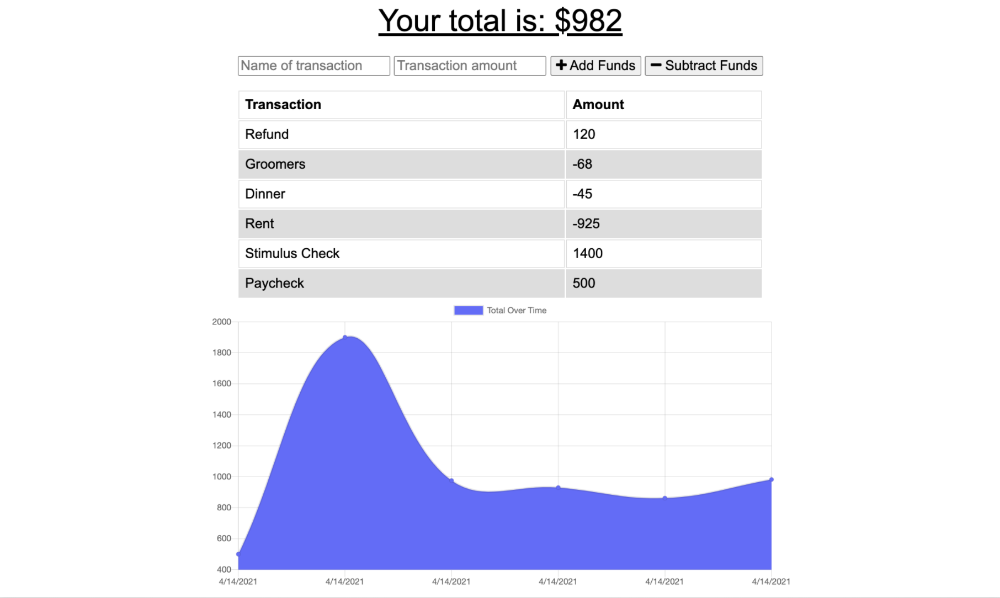

# Budget Tracker

  [](https://opensource.org/licenses/ISC)

  ## Description
  This application allows a user online and offline access to add and track expenses and deposits. This offers users a fast and easy way to track their money from anywhere at anytime.

  ## Table of Contents

  * [Description](#Description)
  * [Installation](#Installation)
  * [Usage](#Usage)
  * [License](#License)
  * [Questions](#Questions)

  ## Installation

  To install necessary dependencies, please run the following command:
  ```
  npm install budget-tracker
  ```

  ## Usage
  Please enter expenses into the field and then click 'subtract funds'. For deposits, enter your amount into the field and click 'add funds'.

    

    [Deployed Application](https://budget----tracker.herokuapp.com/)

  ## License
  This project is covered under the ISC license. Visit the following link for more information on this license: [ISC](https://opensource.org/licenses/ISC)

  ## Questions
  For any questions about the project, please contact me by either of the following links:
  
  * Email - alexhstrickland@gmail.com 
  
  or visit my GithHub profile
  
  * GitHub - [alexhstrickland](https://github.com/alexhstrickland)

